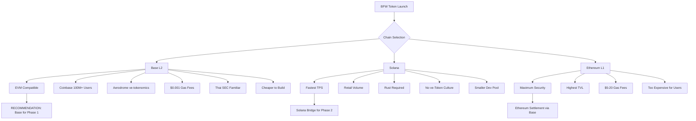
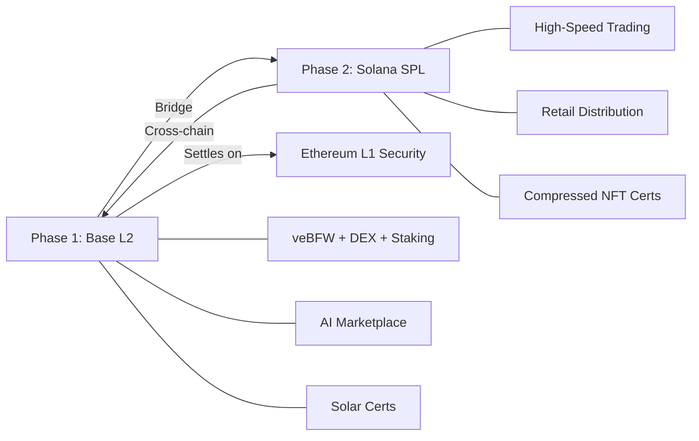

# BFW Chain Selection Analysis
## Solana vs Ethereum vs Base — DeFi Ecosystem & Developer Tooling Focus
### March 2026

---

## Executive Summary

This analysis compares **Solana**, **Ethereum L1**, and **Base (Coinbase L2)** as deployment targets for the BFW token, with emphasis on DeFi ecosystem maturity and developer tooling. The evaluation covers seven dimensions critical to Baseflow's success as an AI + DeFi + Solar infrastructure protocol.

**Bottom line:** Base is the strongest fit for BFW's Phase 1 launch. Solana is a compelling secondary deployment target for Phase 2+.

---

## 1. DeFi Ecosystem Maturity

### 1.1 Ethereum L1

| Metric | Value | Notes |
|--------|-------|-------|
| Total DeFi TVL | ~$120B+ | Dominant chain by TVL; ~50% of all DeFi |
| Major Protocols | Uniswap, Aave, Curve, Lido, MakerDAO, Compound, Eigenlayer | Every blue-chip DeFi protocol launched here first |
| DEX Daily Volume | $2–5B | Uniswap V3 alone does $1–3B/day |
| Lending TVL | $40B+ | Aave + Compound + Spark |
| Stablecoin Supply | $100B+ | USDC, USDT, DAI all native |
| ve-Tokenomics Ecosystem | Mature | Curve, Balancer, Velodrome all pioneered here |
| Composability Depth | Deepest in crypto | Thousands of protocols interoperable via ERC-20 |

**Assessment:** Ethereum is the gold standard for DeFi. Every mechanism BFW plans to use — ve-tokenomics, real yield, liquidity mining, lending integration — was invented and battle-tested on Ethereum. However, L1 gas costs make it impractical for high-frequency operations.

### 1.2 Base (Coinbase L2)

| Metric | Value | Notes |
|--------|-------|-------|
| Total DeFi TVL | ~$12–15B | Fastest-growing L2 in 2025–2026 |
| Major Protocols | Aerodrome, Uniswap V3, Aave V3, Morpho, Extra Finance | Full DeFi stack deployed |
| DEX Daily Volume | $500M–$2B | Aerodrome is the dominant DEX |
| Lending TVL | $3–5B | Aave V3, Morpho, Moonwell |
| Stablecoin Supply | $10B+ | USDC native via Coinbase; strong USDT presence |
| ve-Tokenomics Ecosystem | Strong | Aerodrome is the ve(3,3) leader on Base |
| Composability | Full EVM | Inherits all Ethereum tooling and standards |
| Coinbase Integration | Native | Direct fiat on-ramp for 100M+ Coinbase users |

**Assessment:** Base has achieved critical mass for DeFi. Aerodrome's ve(3,3) model is directly relevant to BFW's planned veBFW mechanics. The Coinbase on-ramp is a massive distribution advantage — no other L2 has a 100M+ user fiat gateway built in.

### 1.3 Solana

| Metric | Value | Notes |
|--------|-------|-------|
| Total DeFi TVL | ~$8–12B | Strong growth; concentrated in fewer protocols |
| Major Protocols | Jupiter, Raydium, Marinade, Orca, Drift, Kamino | Jupiter is the dominant aggregator |
| DEX Daily Volume | $2–8B | Jupiter alone does $1–5B/day; often exceeds Ethereum |
| Lending TVL | $2–4B | Kamino, Solend, MarginFi |
| Stablecoin Supply | $12B+ | USDC native; growing USDT |
| ve-Tokenomics Ecosystem | Limited | No major ve-token protocol; not a cultural norm |
| Composability | SPL standard | Different from EVM; requires separate codebase |
| Retail Adoption | Very high | Phantom wallet; memecoin culture drives volume |

**Assessment:** Solana has explosive trading volume and retail adoption. Jupiter is arguably the best DEX aggregator in crypto. However, the DeFi stack is narrower — fewer lending protocols, no mature ve-tokenomics ecosystem, and the culture is more trading/memecoin-oriented than DeFi-infrastructure-oriented.

### 1.4 DeFi Maturity Scorecard

| Dimension | Ethereum L1 | Base | Solana |
|-----------|:-----------:|:----:|:------:|
| TVL Depth | 10/10 | 7/10 | 6/10 |
| Protocol Diversity | 10/10 | 8/10 | 6/10 |
| ve-Tokenomics Support | 10/10 | 9/10 | 3/10 |
| Lending/Borrowing | 10/10 | 8/10 | 6/10 |
| Stablecoin Liquidity | 10/10 | 9/10 | 8/10 |
| DEX Volume | 8/10 | 7/10 | 9/10 |
| Real Yield Culture | 9/10 | 8/10 | 5/10 |
| Composability | 10/10 | 9/10 | 6/10 |
| **Total** | **77/80** | **65/80** | **49/80** |

---

## 2. Developer Tooling & Infrastructure

### 2.1 Ethereum / Base (EVM Ecosystem)

Since Base is an OP Stack L2, it shares the entire Ethereum developer tooling ecosystem:

| Tool Category | Available Tools | Maturity |
|---------------|----------------|----------|
| Smart Contract Language | Solidity, Vyper | Production-grade; 8+ years of battle-testing |
| Development Frameworks | Hardhat, Foundry, Truffle, Brownie | Foundry is the 2026 standard; blazing fast |
| Testing | Forge (Foundry), Hardhat tests, Echidna (fuzzing) | Most mature testing ecosystem in crypto |
| Deployment | Hardhat Deploy, Foundry scripts, Thirdweb | One-click deployment to Base |
| Indexing | The Graph, Goldsky, Envio, Ponder | Subgraph ecosystem is massive |
| Oracles | Chainlink, Pyth, Redstone, API3 | All available on Base |
| Wallets | MetaMask, Coinbase Wallet, Rainbow, Rabby | MetaMask alone has 30M+ users |
| Block Explorers | Etherscan, Basescan, Blockscout | Full-featured, well-documented |
| Security Auditing | OpenZeppelin, Trail of Bits, Certora, Slither | Largest auditor ecosystem |
| Token Standards | ERC-20, ERC-721, ERC-1155, ERC-4626 | Every standard BFW needs exists |
| Bridge Infrastructure | Across, Stargate, LayerZero, Wormhole | Mature cross-chain from Base |
| AI/ML Integration | Chainlink Functions, Gelato, OpenAI via oracles | Growing but functional |

**Key advantage:** Any Solidity developer can build on Base. The talent pool is 10–50x larger than Solana's. OpenZeppelin contracts provide audited, battle-tested building blocks for every BFW feature (ERC-20, governance, vesting, staking).

**Base-specific tooling:**
- **Coinbase Developer Platform** — APIs for fiat on-ramp, identity verification, wallet-as-a-service
- **OnchainKit** — Coinbase's React component library for building on Base
- **Coinbase Smart Wallet** — Gasless transactions via paymaster; reduces onboarding friction
- **Base Sepolia testnet** — Free, fast testnet with faucets

### 2.2 Solana Ecosystem

| Tool Category | Available Tools | Maturity |
|---------------|----------------|----------|
| Smart Contract Language | Rust (native), Anchor framework | Steep learning curve; Anchor helps but still Rust |
| Development Frameworks | Anchor, Seahorse (Python-like), Native Rust | Anchor is dominant; fewer alternatives |
| Testing | Anchor tests, Bankrun, solana-test-validator | Functional but less mature than EVM |
| Deployment | Anchor deploy, Solana CLI | Works but less tooling around CI/CD |
| Indexing | Helius, Shyft, GenesysGo, The Graph (limited) | Helius is excellent; ecosystem is growing |
| Oracles | Pyth (native), Switchboard, Chainlink (limited) | Pyth is best-in-class for price feeds |
| Wallets | Phantom, Solflare, Backpack | Phantom is excellent UX |
| Block Explorers | Solscan, Solana Explorer, SolanaFM | Good but fewer features than Etherscan |
| Security Auditing | OtterSec, Neodyme, Sec3 | Smaller auditor pool; fewer Rust auditors globally |
| Token Standards | SPL Token, Token-2022 (extensions) | Token-2022 adds transfer hooks, confidential transfers |
| Bridge Infrastructure | Wormhole, deBridge, Allbridge | Functional but fewer options |
| AI/ML Integration | Limited on-chain; off-chain via Bittensor integration | Less mature |

**Key challenge:** Rust development is significantly harder to hire for. The global pool of Solana/Rust smart contract developers is estimated at 5,000–15,000 vs 200,000+ Solidity developers. Auditing costs are higher due to fewer qualified Rust auditors.

**Solana-specific advantages:**
- **Token-2022** — Built-in transfer fees, confidential transfers, and metadata extensions at the protocol level
- **Compressed NFTs** — State compression for cheap minting (relevant for solar certificates)
- **Blinks/Actions** — Solana Actions allow transactions from any URL (social media integration)

### 2.3 Developer Tooling Scorecard

| Dimension | Ethereum/Base | Solana |
|-----------|:------------:|:------:|
| Language Accessibility | 9/10 (Solidity is easy) | 5/10 (Rust is hard) |
| Framework Maturity | 10/10 (Foundry/Hardhat) | 7/10 (Anchor) |
| Testing Tools | 10/10 | 7/10 |
| Auditor Availability | 10/10 | 5/10 |
| Developer Talent Pool | 10/10 (200K+ devs) | 5/10 (10K–15K devs) |
| Documentation Quality | 9/10 | 7/10 |
| Open-Source Libraries | 10/10 (OpenZeppelin) | 6/10 |
| Indexing/Data | 9/10 | 7/10 |
| Oracle Support | 10/10 | 7/10 |
| Wallet Ecosystem | 9/10 | 8/10 |
| **Total** | **96/100** | **64/100** |

---

## 3. Transaction Costs & Performance

| Metric | Ethereum L1 | Base | Solana |
|--------|:-----------:|:----:|:------:|
| Avg Transaction Cost | $1–$20 | $0.001–$0.01 | $0.0001–$0.001 |
| Block Time | ~12 seconds | ~2 seconds | ~400ms |
| TPS (practical) | ~15–30 | ~100–1000 | ~2,000–5,000 |
| Finality | ~12 minutes | ~12 minutes (L1 finality) | ~400ms (optimistic) / ~12s (confirmed) |
| MEV Protection | Flashbots, MEV-Share | Flashbots on Base | Jito (MEV marketplace) |

**For BFW:** Base offers the best balance — near-zero gas costs for users while inheriting Ethereum's security. Solana is faster and cheaper but with different security guarantees.

---

## 4. Regulatory & Compliance Considerations

### Thai SEC Context

Thailand's SEC regulates digital assets under the Digital Asset Business Decree B.E. 2561 (2018). Key considerations:

| Factor | Ethereum/Base | Solana |
|--------|:------------:|:------:|
| Thai SEC familiarity | High — most licensed Thai exchanges list ERC-20 tokens | Medium — Solana tokens listed but less common |
| Licensed exchange support | Bitkub, Satang Pro, Zipmex all support ERC-20 | Some support SPL tokens |
| Compliance tooling | Chainalysis, Elliptic full EVM support | Growing but less coverage |
| KYC/AML integration | Mature via Coinbase (Base) | Less integrated |
| Smart contract auditability | Well-understood by Thai regulators | Less familiar |

**Assessment:** For Thai SEC compliance, EVM/Base is the safer choice. Thai regulators and licensed exchanges are more familiar with ERC-20 tokens. Coinbase's compliance infrastructure on Base adds an extra layer of regulatory credibility.

---

## 5. BFW-Specific Feature Mapping

How well does each chain support BFW's planned features?

| BFW Feature | Ethereum L1 | Base | Solana |
|-------------|:-----------:|:----:|:------:|
| ERC-20 / SPL Token | Native | Native | SPL (different standard) |
| veBFW (vote-escrow) | Proven (Curve model) | Proven (Aerodrome model) | No established pattern |
| DEX with LP rewards | Uniswap V3 fork | Aerodrome / Uniswap V3 | Raydium / Orca |
| AI inference marketplace | Chainlink Functions | Chainlink Functions | Limited on-chain |
| Solar certificate NFTs | ERC-721 / ERC-1155 | ERC-721 / ERC-1155 | Compressed NFTs (cheaper) |
| Cross-chain bridges | Native hub | Via Ethereum bridges | Wormhole |
| DAO governance | Governor (OZ) | Governor (OZ) | Realms / SPL Governance |
| Staking contracts | Battle-tested patterns | Same as Ethereum | Marinade-style |
| Real yield distribution | Proven (GMX, Aave) | Proven (Aerodrome) | Less established |
| Proof of Green Stake | Custom contract | Custom contract | Custom program (Rust) |
| Emergency broadcast layer | Off-chain + attestation | Off-chain + attestation | Off-chain + attestation |

---

## 6. Cost to Build & Maintain

| Cost Factor | Base (EVM) | Solana |
|-------------|:----------:|:------:|
| Smart contract development | $50K–$150K | $100K–$300K (Rust premium) |
| Security audit | $30K–$80K | $50K–$150K (fewer auditors) |
| Frontend development | Same | Same |
| Ongoing maintenance | Lower (larger talent pool) | Higher (Rust specialists) |
| Deployment costs | ~$50–$500 | ~$5–$50 |
| Hiring difficulty | Moderate | High (Rust devs scarce) |

**Assessment:** Building on Base/EVM is roughly 40–60% cheaper than Solana due to the larger developer talent pool, more auditor competition, and reusable open-source contracts (OpenZeppelin).

---

## 7. Strategic Positioning

### Why Base Wins for Phase 1

### Multi-Chain Strategy

---

## 8. Recommendation

### Primary Chain: Base (Coinbase L2)

**Rationale:**

1. **DeFi ecosystem fit** — Aerodrome's ve(3,3) model is the closest existing implementation to BFW's planned veBFW mechanics. BFW can integrate directly with Aerodrome's gauge system or fork the proven contracts.

2. **Developer tooling** — Full EVM compatibility means access to Foundry, Hardhat, OpenZeppelin, The Graph, Chainlink, and the entire Ethereum tooling stack. The talent pool is 10–20x larger than Solana's.

3. **Coinbase distribution** — 100M+ Coinbase users can on-ramp to Base with fiat in minutes. No other chain offers this built-in distribution channel. For a Thailand-based project targeting global investors, this is a massive advantage.

4. **Cost efficiency** — $0.001 gas fees make BFW accessible for micro-transactions (AI inference queries, solar cert fees) while inheriting Ethereum's security guarantees.

5. **Regulatory alignment** — Thai SEC and licensed exchanges are most familiar with ERC-20 tokens. Coinbase's compliance infrastructure adds credibility for institutional investors.

6. **Build cost** — 40–60% cheaper to develop and audit on EVM vs Solana. More auditors, more open-source code to build on, easier to hire.

### Secondary Chain: Solana (Phase 2 Bridge)

**Rationale for Phase 2 expansion:**

1. **Trading volume** — Solana's DEX volume often exceeds Ethereum's. A BFW/SOL pair on Jupiter/Raydium captures retail traders.

2. **Speed** — 400ms block times enable real-time AI inference payment settlement.

3. **Compressed NFTs** — Solar certificates could be minted cheaply as compressed NFTs on Solana for mass distribution.

4. **Retail reach** — Phantom wallet's user base and Solana's memecoin culture provide viral distribution potential.

### NOT Recommended: Ethereum L1

**Rationale against L1 deployment:**

- $5–$20 gas fees make micro-transactions (AI queries, small staking) impractical
- Base inherits all of Ethereum's security while eliminating the cost barrier
- No unique advantage over Base for BFW's use case

---

## 9. Decision Matrix Summary

| Criterion | Weight | Base | Solana | Ethereum L1 |
|-----------|:------:|:----:|:------:|:-----------:|
| DeFi Ecosystem Maturity | 25% | 8/10 | 6/10 | 10/10 |
| Developer Tooling | 20% | 9/10 | 6/10 | 9/10 |
| Transaction Cost | 15% | 9/10 | 10/10 | 3/10 |
| ve-Tokenomics Support | 15% | 9/10 | 3/10 | 10/10 |
| Distribution/On-ramp | 10% | 10/10 | 7/10 | 6/10 |
| Regulatory Fit (Thailand) | 10% | 9/10 | 6/10 | 8/10 |
| Build Cost | 5% | 8/10 | 5/10 | 8/10 |
| **Weighted Total** | **100%** | **8.75** | **6.15** | **7.85** |

### Final Verdict

| Priority | Chain | Role |
|----------|-------|------|
| **1 — Launch** | **Base** | Primary chain: BFW ERC-20, veBFW, DEX, staking, AI marketplace, solar certs |
| **2 — Expand** | **Solana** | Secondary chain via bridge: trading pairs, compressed NFT certs, retail reach |
| **3 — Settle** | **Ethereum L1** | Security layer: Base settles on Ethereum automatically; no separate deployment needed |

---

## 10. Node Power Implications

From [SOLAR_RESEARCH.md](../SOLAR_RESEARCH.md:16), the power requirements differ significantly:

| Node Type | Power Draw | Daily kWh | Solar System Needed |
|-----------|-----------|-----------|-------------------|
| Ethereum/Base node | 50–200W | 1.2–4.8 kWh | 1.5–5 kW |
| Solana validator | 400–600W | 10–14 kWh | 7–8 kW |

**For solar-powered infrastructure**, Base/Ethereum nodes require 3–5x less energy than Solana validators. This directly impacts BFW's Proof of Green Stake economics — more nodes can run on less solar hardware, reducing the per-node investment from ~$20K to potentially $8–12K for lighter EVM nodes.

---

*Analysis compiled for Baseflow internal decision-making. Based on publicly available data as of March 2026.*
