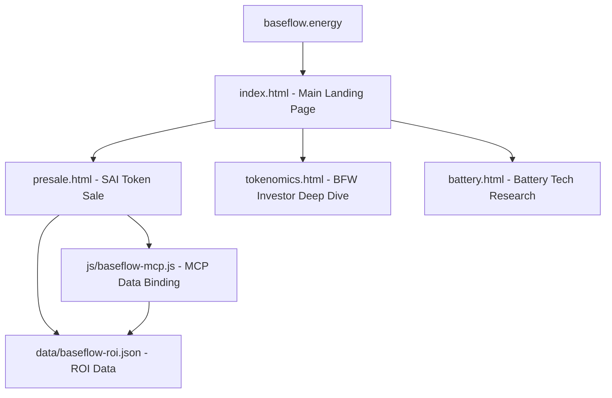
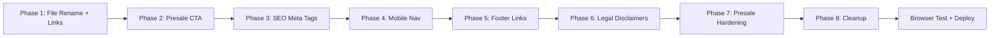

# Baseflow Site — Production Readiness Plan

**Domain:** baseflow.energy  
**Token Structure:** BFW (project token) + SAI (presale token on Polygon)  
**Landing Page:** baseflow.html → becomes index.html  
**Presale Page:** sai-token-sale-v2.html → becomes presale.html  

---

## Site Architecture (Production)



---

## Phase 1: Critical Fixes & File Structure

### 1.1 Rename & Reorganize Files

| Action | From | To | Reason |
|--------|------|----|--------|
| Rename | `baseflow.html` | `index.html` | Landing page must be index.html for web hosting |
| Rename | `sai-token-sale-v2.html` | `presale.html` | Clean URL: baseflow.energy/presale.html |
| Delete | `index.html` | — | Old pitch deck, replaced by baseflow.html |
| Delete | `index2.html` | — | Draft file, not used |
| Delete | `index3.html` | — | Draft file, not used |
| Delete | `sai-token-sale (1).html` | — | Old v1 of sale page, superseded by v2 |

### 1.2 Update All Internal Links

After renaming, every cross-page link must be updated:

- **In new `index.html`** (was baseflow.html):
  - `tokenomics.html` link → stays the same ✓
  - `battery.html` link → stays the same ✓
  - Add new link to `presale.html`

- **In `tokenomics.html`**:
  - `baseflow.html` → `index.html` (nav back link, footer links)

- **In `battery.html`**:
  - `baseflow.html` → `index.html` (nav back link, footer links)

- **In new `presale.html`** (was sai-token-sale-v2.html):
  - OG URLs: `baseflow.io` → `baseflow.energy`
  - Canonical URL: `baseflow.io/presale` → `baseflow.energy/presale.html`

### 1.3 Fix Presale Page Domain References

All instances of `baseflow.io` in presale.html must change to `baseflow.energy`:
- `<meta property="og:url">` 
- `<link rel="canonical">`
- `<meta property="og:image">`
- Share links in the celebration modal
- Footer email: `info@baseflow.io` → `info@baseflow.energy`

---

## Phase 2: Add Presale CTA to Landing Page

### 2.1 Navigation Bar Update

Add a prominent "Buy SAI →" button to the nav links in `index.html`:

```html
<a href="presale.html" style="background:rgba(245,158,11,0.15);border:1px solid rgba(245,158,11,0.4);border-radius:6px;padding:6px 14px;color:#f59e0b;font-size:0.8rem;font-weight:600;">Buy SAI →</a>
```

### 2.2 Hero CTA Update

Add a third CTA button in the hero section:

```html
<a href="presale.html" class="btn btn-primary" style="background:linear-gradient(135deg,#f59e0b,#f97316);box-shadow:0 0 24px rgba(245,158,11,0.3);">Buy SAI Tokens — Presale Live</a>
```

### 2.3 Footer Update

Add presale link to footer navigation.

---

## Phase 3: SEO & Meta Tags

### 3.1 Add Meta Tags to All Pages

Every page needs:
- `<meta name="description">`
- `<meta property="og:title">`
- `<meta property="og:description">`
- `<meta property="og:type" content="website">`
- `<meta property="og:url">`
- `<meta property="og:image">`
- `<meta name="twitter:card" content="summary_large_image">`
- `<meta name="twitter:title">`
- `<meta name="twitter:description">`
- `<link rel="canonical">`

**Pages needing meta tags added:**
- `index.html` (currently has zero meta tags beyond charset/viewport)
- `tokenomics.html` (currently has zero meta tags)
- `battery.html` (currently has zero meta tags)
- `presale.html` (already has meta tags — just needs domain fix)

### 3.2 Favicon

Add favicon reference to all pages:
```html
<link rel="icon" type="image/svg+xml" href="data:image/svg+xml,<svg xmlns='http://www.w3.org/2000/svg' viewBox='0 0 100 100'><text y='.9em' font-size='90'>⚡</text></svg>">
```

Or create a proper favicon.ico/favicon.png if available.

### 3.3 OG Image

The presale page references `https://baseflow.energy/og-presale.png` — this image needs to be created and deployed. All pages should have an OG image. A simple branded card (1200×630px) with the Baseflow logo and tagline.

---

## Phase 4: Mobile Navigation

### 4.1 Problem

All four pages hide `.nav-links` on mobile (`@media max-width:768px`) with **no hamburger menu toggle**. Mobile users cannot navigate between pages.

### 4.2 Solution

Add a hamburger menu button and toggle script to all pages:

```html
<button class="nav-toggle" onclick="document.querySelector('.nav-links').classList.toggle('open')" aria-label="Menu">☰</button>
```

With CSS:
```css
.nav-toggle { display: none; background: none; border: none; color: var(--accent); font-size: 1.5rem; cursor: pointer; }
@media (max-width: 768px) {
  .nav-toggle { display: block; }
  .nav-links { display: none; position: absolute; top: 64px; left: 0; right: 0; flex-direction: column; background: rgba(8,13,20,0.98); padding: 1rem 5%; gap: 1rem; border-bottom: 1px solid var(--border); }
  .nav-links.open { display: flex; }
}
```

**Affected pages:** index.html, tokenomics.html, battery.html, presale.html

---

## Phase 5: Footer & Social Links

### 5.1 Fix Placeholder Links

All pages have footer social links pointing to `#`. Update to:
- Twitter/X: `https://x.com/BaseflowEnergy` (or actual handle)
- Discord: `https://discord.gg/baseflow` (or actual invite)
- GitHub: `https://github.com/baseflow` (or actual org)
- Website: `https://baseflow.energy`

### 5.2 Add Presale Link to All Footers

Every page footer should include a link to the presale page.

### 5.3 Update Copyright Year

Ensure all footers show `© 2026 Baseflow`.

---

## Phase 6: Legal & Compliance

### 6.1 Disclaimers

Per AGENTS.md tokenization guardrails:
- Token = community support, access, and mission participation; never investment or ownership
- Never promise returns, price increases, or financial outcomes
- Avoid securities language

**Review needed on:**
- `index.html` hero stats: "55% Solar Cost Advantage" — fine (factual)
- `tokenomics.html` ROI scenarios: Already has disclaimer — good
- `presale.html` ROI section: Has "hypothetical projections" disclaimer — good
- `presale.html` buy disclaimer: Has "not a securities offering" — good

**Add to all pages:**
```html
<meta name="robots" content="index, follow">
```

### 6.2 Legal Pages (Minimal)

Create minimal placeholder pages or add inline sections:
- Terms of Service — at minimum, a section in the footer or a `terms.html`
- Privacy Policy — required if collecting wallet addresses via Supabase

For MVP launch, an inline disclaimer in the presale footer is acceptable, but proper legal pages should follow.

---

## Phase 7: Presale Page Production Hardening

### 7.1 Supabase Anon Key Verification

The configured anon key `sb_publishable_wnxOklCcLNNW4o1jnN_UOg_guz60nHc` uses a non-standard prefix. Standard Supabase anon keys start with `eyJ...` (JWT format). This needs verification — if the key is wrong, the purchases table won't work.

**Action:** Verify the key works by testing a Supabase query, or replace with the correct key from the Supabase dashboard (Settings → API → anon/public key).

### 7.2 Dev Banner Logic

The dev banner checks for placeholder strings. Since the config now has real values, the banner should stay hidden. Verify this works correctly.

### 7.3 Countdown Timer End Date

Currently set to `2026-06-15T00:00:00Z`. Confirm this is the intended Phase 1 end date.

### 7.4 Share Links

The celebration modal share links reference `@BaseflowNetwork` on Twitter and `baseflow.io/presale`. Update to:
- Twitter handle: `@BaseflowEnergy` (or actual handle)
- URL: `baseflow.energy/presale.html`

---

## Phase 8: Cleanup & Final Polish

### 8.1 Delete Old Files

| File | Reason |
|------|--------|
| `index.html` | Old pitch deck — replaced by baseflow.html becoming index.html |
| `index2.html` | Draft, not linked anywhere |
| `index3.html` | Draft, not linked anywhere |
| `sai-token-sale (1).html` | Old v1 of presale, superseded by v2 |

### 8.2 Files to Keep (No Changes Needed)

| File | Reason |
|------|--------|
| `data/baseflow-roi.json` | MCP data source — working correctly |
| `js/baseflow-mcp.js` | Data binding engine — working correctly |
| `BASEFLOW.md` | Project documentation |
| `AGENTS.md` | Agent rules |
| `AI.md` | AI documentation |
| `plans/*` | Planning documents |
| `.gitignore` | Git config |
| PDF/research files | Reference materials |

---

## Implementation Order



---

## Deployment Checklist

Before going live at baseflow.energy:

- [ ] All pages load without console errors
- [ ] All internal links work (no 404s)
- [ ] Presale page connects to MetaMask on Polygon
- [ ] Supabase purchases table loads (or shows "no purchases yet")
- [ ] Countdown timer shows correct time remaining
- [ ] Mobile navigation works on all pages
- [ ] OG tags render correctly when shared on Twitter/Telegram
- [ ] Footer links point to real destinations
- [ ] "Not financial advice" disclaimer visible on presale page
- [ ] No placeholder values visible (RECEIVING_WALLET, SUPABASE_URL, etc.)
- [ ] HTTPS configured on hosting provider
- [ ] DNS for baseflow.energy pointing to hosting

---

## Risk Notes

1. **Supabase anon key format** — The key prefix `sb_publishable_` is unusual. Standard Supabase keys are JWTs starting with `eyJ`. This must be verified before launch or purchases won't log.

2. **OG images** — No `og-presale.png` exists yet. Social shares will look bare without it. Can be created as a simple branded card.

3. **Wallet address** — `0x0812522C4c653E9385f085a909b6A43Bb5966cb5` is configured as the receiving wallet. Verify this is correct and controlled by the team before any real funds are sent.

4. **No smart contract** — The presale is a direct USDT transfer to a wallet, not a smart contract. This is simpler but means token distribution at TGE is manual. The page correctly states "tokens distributed at TGE" and "airdropped to your wallet."
